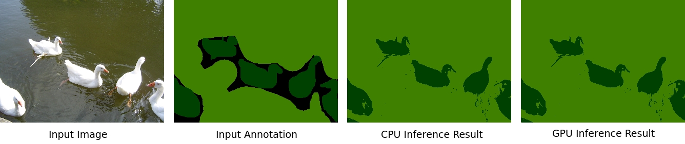

# CPU+GPU Dense CRF

Header-only Dense Conditional Random Field (CRF) in C++ and CUDA with easy-to-use interface for 2D image and unorganized data (such as point cloud).

**NOTE:** This version does not support gradient computation / back propagation of parameters.



For the above example with size $320\times 240$ with 21 classes and 10 iterations, the CPU version takes `225ms` while GPU version takes `88ms` (statistics computed using Linux `time` utility).

## Compile & Run

This is a header only library so all you need to do is to copy all the header files in `include/` directory into your project.

For compiling the examples, you can use the cmake build system:
```bash
mkdir build && cd build
cmake ..
make example_cpu
./example_cpu ../examples/im1.ppm ../examples/anno1.ppm ../examples/res1_cpu.ppm
make example_gpu
./example_gpu ../examples/im1.ppm ../examples/anno1.ppm ../examples/res1_gpu.ppm
```

## Usage

### CPU Version

```C++
#include "densecrf_cpu.h"
#include "pairwise_cpu.h"
using namespace DenseCRF;

// Setup the CRF model
DenseCRFCPU<M> crf(W * H);
crf.setUnaryEnergyFromLabel( label, 0.5 );
// add a color independent term (feature = pixel location 0..W-1, 0..H-1)
// x_stddev = 3
// y_stddev = 3
// weight = 3
auto* smoothnessPairwise = PottsPotentialCPU<M, 2>::FromImage<>(W, H, 3.0, 3.0);
crf.addPairwiseEnergy( smoothnessPairwise );
// add a color dependent term (feature = xyrgb)
// x_stddev = 60
// y_stddev = 60
// r_stddev = g_stddev = b_stddev = 20
// weight = 10
auto* appearancePairwise = PottsPotentialCPU<M, 5>::FromImage<unsigned char>(W, H, 10.0, 60.0, im, 20.0);
crf.addPairwiseEnergy( appearancePairwise );
// Do map inference
crf.inference(10, true);
short * map = crf.getMap();
```

### GPU Version

Please note all pointers should be CUDA device pointer.

```C++
#include "densecrf_gpu.cuh"
#include "pairwise_gpu.cuh"
using namespace DenseCRF;

// Setup the CRF model
DenseCRFGPU<M> crf(W * H);
crf.setUnaryEnergyFromLabel( labelGPU, 0.5 );
// add a color independent term (feature = pixel location 0..W-1, 0..H-1)
// x_stddev = 3
// y_stddev = 3
// weight = 3
auto* smoothnessPairwise = PottsPotentialGPU<M, 2>::FromImage<>(W, H, 3.0, 3.0);
crf.addPairwiseEnergy( smoothnessPairwise );
// add a color dependent term (feature = xyrgb)
// x_stddev = 60
// y_stddev = 60
// r_stddev = g_stddev = b_stddev = 20
// weight = 10
auto* appearancePairwise = PottsPotentialGPU<M, 5>::FromImage<float>(W, H, 10.0, 60.0, rgbFeatGPU, 20.0);
crf.addPairwiseEnergy( appearancePairwise );
// Do map inference
crf.inference(10, true);
short * mapGPU = crf.getMap();
```

## References

Krähenbühl, Philipp, and Vladlen Koltun. "Efficient inference in fully connected crfs with gaussian edge potentials." *Advances in neural information processing systems*. 2011.

Adams, Andrew, Jongmin Baek, and Myers Abraham Davis. "Fast high‐dimensional filtering using the permutohedral lattice." *Computer Graphics Forum*. Vol. 29. No. 2. Oxford, UK: Blackwell Publishing Ltd, 2010.